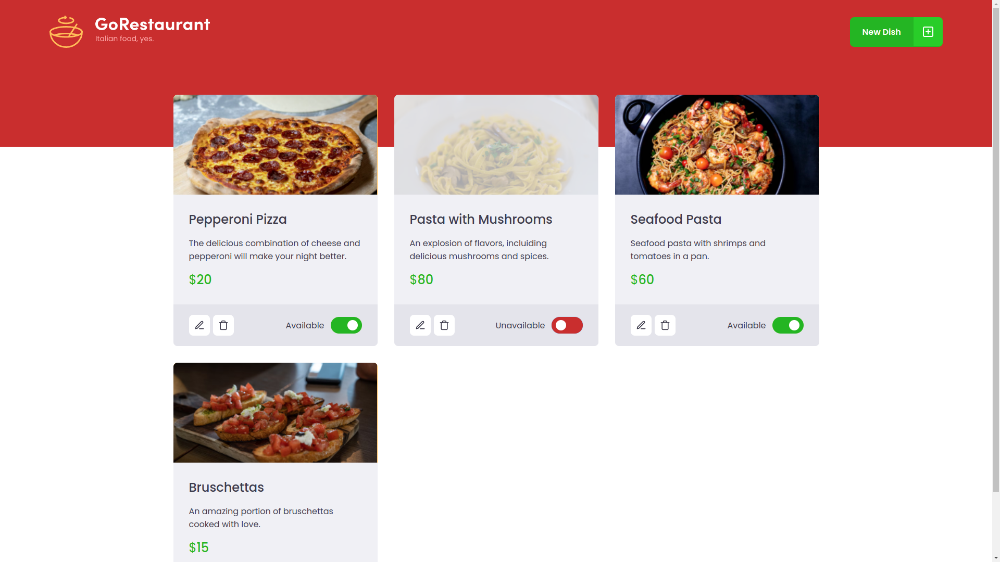
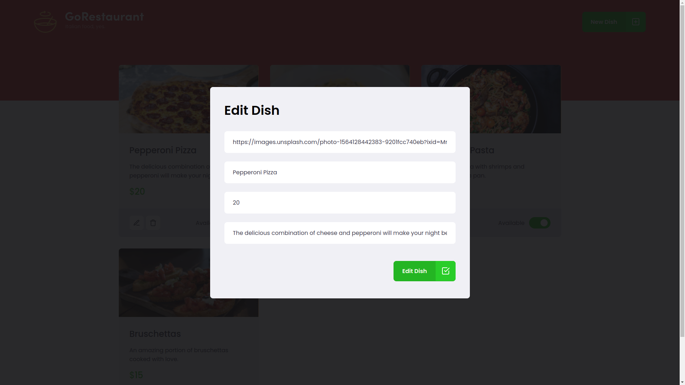

  

## About
<strong>GoRestaurant</strong> is a React application that allows you to register,edit and delete all your favorite italian dishes. The application is a challenge of a web bootcamp about React JS and the main goal of this challenge was to refactor an application using Class-Based components to an application using Function-Based components.

## Screenshots

### Home

### New dish

### Edit dish

## Technologies

### React

### Typescript

## How to use it

1. Clone the repository with `git clone https://github.com/Eduardo-H/refactoring-challenge`
2. Enter the folder directory with `cd refactoring-challenge/`
3. Install all the project's dependencies with `yarn`
4. Open another terminal and start the local server with `yarn server`
5. Start the project with `yarn start`

PS: The server must be running for the application to work.